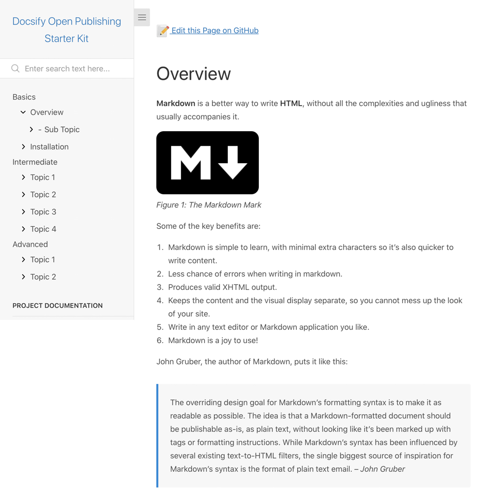

# Open Publishing Starter Kit

> This is a starter kit to create an open [Docsify](https://docsify.js.org) documentation site, with a link automatically created on each page to edit the source Markdown text in a GitHub or GitLab repository.

📸 Docsify Open Publishing Starter Kit Screenshot
---

_Figure 1. Docsify Open Publishing Starter Kit. Explore a demo at [hibbitts-design.github.io/docsify-open-publishing-starter-kit/](https://hibbitts-design.github.io/docsify-open-publishing-starter-kit/)_

🚀 Quick GitHub Pages Install Instructions
---
**Pre-flight Checklist**  

1. GitHub account

**Installation Steps**  

1. Fork this repository
2. Go to **Settings** of your repository, scroll down to **GitHub Pages** and chose **master branch/docs folder** (see more details in the [Docsify documentation](https://docsify.now.sh/deploy?id=gitlab-pages))
3. And you're done! (view your new site using the provided URL right below your **GitHub Pages** section - it can take up to 20 minutes for your site to be initially available)

Want to delete the fork dependency of your newly created repository?

1. Select the + sign in the top right corner, and choose **Import repository**
2. Import your forked repository (the new repository won't have the fork dependency)
3. Delete the original forked repository via the repository **settings**.

📝 "Edit the Page on GitHub" Link Setup
---

1. Edit the file `index.html` in your repository
2. Find the sample GitHub repository URL `https://github.com/hibbitts-design/docsify-open-publishing-starter-kit/tree/master/docs/` and replace it with your own repository URL, for example `https://github.com/YourGitHubUsername/Docsify/blob/master/docs/`
3. Commit your changes.

💻 Editing your Docsify Site Locally
---  

1. Tap **Clone** on your repository page
2. Choose **Open Desktop** and follow the prompts, installing GitHub Desktop if not already present
3. You will now be able to edit your Docsify site (in the `docs` folder) using the desktop editor of your choice (e.g. atom.io)
4. Use GitHub Desktop to push any changes to your repository. [Learn more about using GitHub Desktop](https://help.github.com/en/desktop/contributing-to-projects/committing-and-reviewing-changes-to-your-project).

You can also clone (i.e download) a copy of your repository to your computer and [run Docsify locally](https://docsify.js.org/#/quickstart) to preview your site. See the below video for details.

Do you use GitLab? You can also use Docsify with [GitLab Pages](https://docsify.now.sh/deploy?id=gitlab-pages)!

📼 Video Walkthrough of Local Docsify Install/Config
---
  
_Video 1. Generating Documentation Sites with GitHub and Docsify - Alysson Alvaran_

📚 Learn More about Docsify
---
[Docsify Documentation](https://docsify.js.org/#/?id=docsifyg)

🙇‍Credits and Special Thanks
---
[Docsify Themeable](https://github.com/jhildenbiddle/docsify-themeable)  
