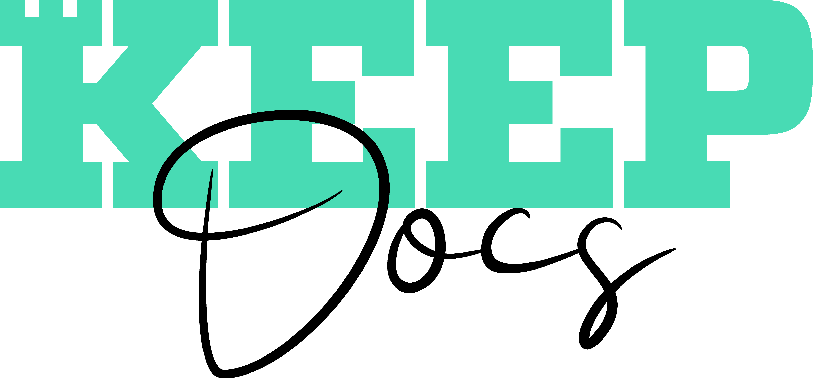

> A minimal quickstart template for a docs site <!-- TODO: Replace with your description -->

<!-- TODO: Update to match your project's benefits/features. Git emojis work great here. -->

- :hourglass_flowing_sand: Quickly setup an elegant, responsive site

[Use this template](https://github.com/MichaelCurrin/docsify-js-template/generate) <!-- TODO: Remove on your copy of this template.-->
[Get Started](#docsifyjs-template-homepage) <!-- TODO: Use ID of your homepage heading i.e. based on H1 of README.md - make sure this is DIFFERENT to the cover's heading -->

